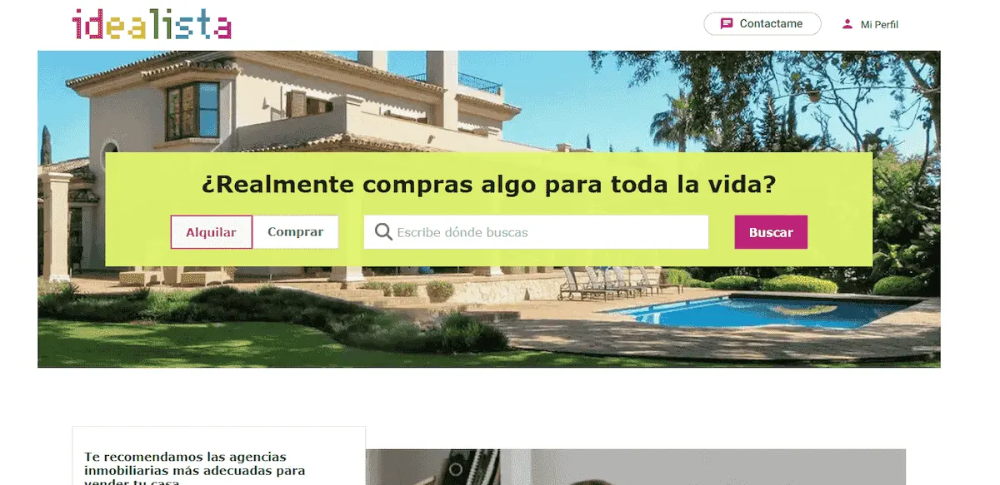
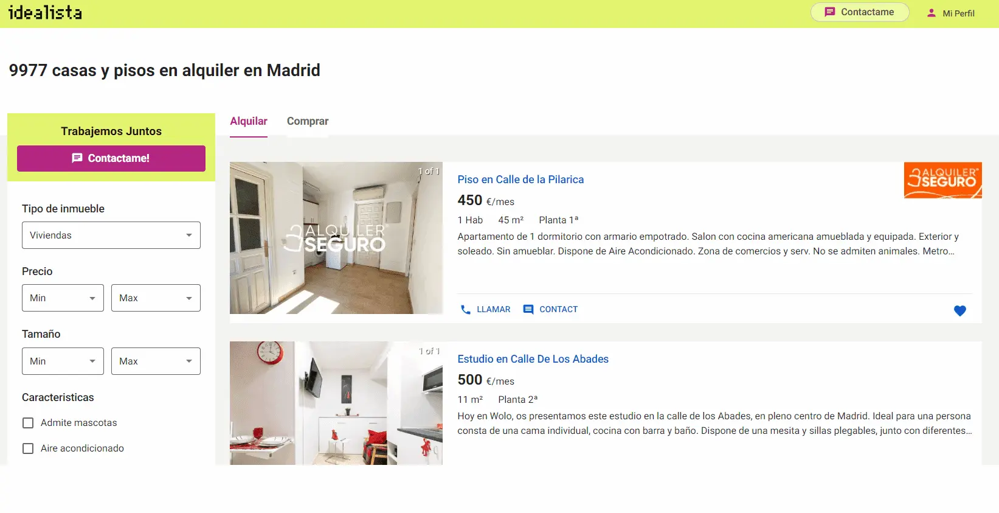
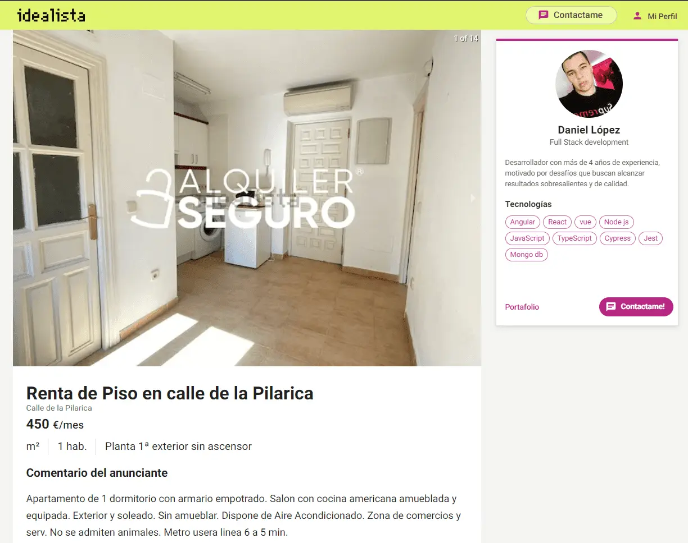

# Clone idealista 

Clone idealista es un proyecto, desarrollado con `React`, `typeScript` y `next js`. contiene las mismas funcionalidades que el mayor buscador de viviendas en España [Idealista](https://www.idealista.com/).

 <a href="https://clone-idealista.vercel.app/" target="_blank">Demo</a>

## Contacto 🚀|

- Website: <a href="https://danidev.me/" target="_blank">https://danidev.me/</a> 
- LinkedIn:  <a href="https://www.linkedin.com/in/dani-dev/" target="_blank">@dani-dev</a>
- Github: <a href="https://github.com/ldani-dev" target="_blank">@ldanidev</a>
- Twitter: <a href="https://twitter.com/ldanidev" target="_blank">@ldanidev</a>

## Contenido

### **- Vista Principal**

### **- Lista de viviendas**

### **- vista de cada Vivienda**

### **- Detalle de cada vivienda**

## - Diseño responsive

El sistema es adaptativo para diferentes dispositivos solamente utilizando `scss`.
