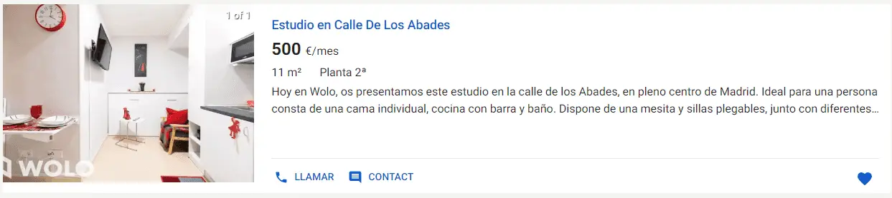

# Clone idealista 

Clone idealista es un proyecto, desarrollado con `React`, `typeScript` y `next js`. contiene las mismas funcionalidades que el mayor buscador de viviendas en España [Idealista](https://www.idealista.com/).

[Demo](https://clone-idealista.vercel.app/)

## Contacto 🚀

[sitio web](https://www.daniellopezj.com/)
| [LinkedIn](https://www.linkedin.com/in/daniel-lopezj/)
| [Github](https://github.com/daniellopezj)
| [Twitter](https://twitter.com/daniellopezj_)

## Contenido

### **- Vista Principal**

### **- Lista de viviendas**

### **- vista de cada Vivienda**

### **- Detalle de cada vivienda**

## - Diseño responsive

El sistema es adaptativo para diferentes dispositivos solamente utilizando `scss`.
